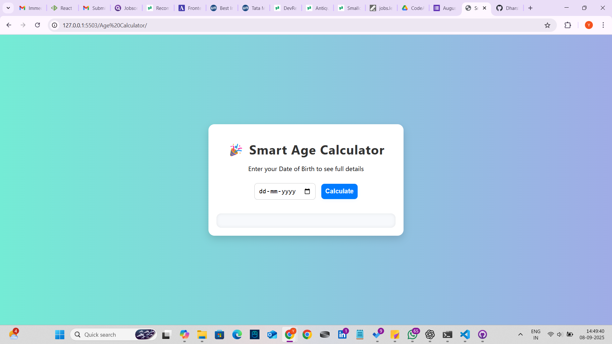

# 🚀 Smart Age Calculator

This is a web application built using **HTML, CSS, and JavaScript** as part of my **CodeAlpha Internship**.

## ✨ Features
- ✅ Calculate exact age in **years, months, and days**
- ✅ Show **next birthday countdown** 🎂
- ✅ Display **zodiac sign** ♈
- ✅ Show **day of the week** user was born 📅
- ✅ Responsive and clean UI design

## 🛠️ Tech Stack
- **HTML** – structure
- **CSS** – styling & responsiveness
- **JavaScript** – logic (Date object, DOM manipulation)

## 📸 Screenshot

## 🔗 Live Demo
👉 [Click here to view on GitHub Pages](https://YOUR_USERNAME.github.io/CodeAlpha-AgeCalculator/)

## 📌 Internship Info
This project was completed as **Task 1 (Mandatory)** for the **CodeAlpha Web Development Internship**.
